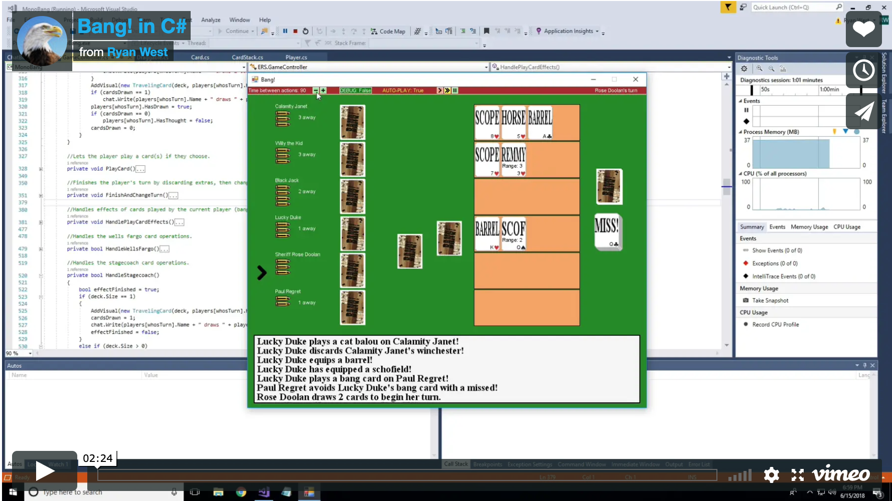

# Bang! Card Game
This is a C# visual implementation of the Bang! card game. It was originally built using Microsoft's XNA Game Development Framework (now deprecated), but has since been updated to work with [MonoGame](http://www.monogame.net). 

In this implementation, only computer players can play against each other. Intelligent AI classes were developed which each cpu use strategically try to get an edge over other players and win. This is only a partial implementation of the game with a few cards and all character roles remaining to be added.

This game was one of my earliest programming projects and was written somewhat poorly, not reflecting my current coding conventions or style. Still, it was one of my favorite projects and has a nice UI, so I thought to share it nevertheless. This was written entirely on my own with no motive but to improve my coding knowledge and have fun.
